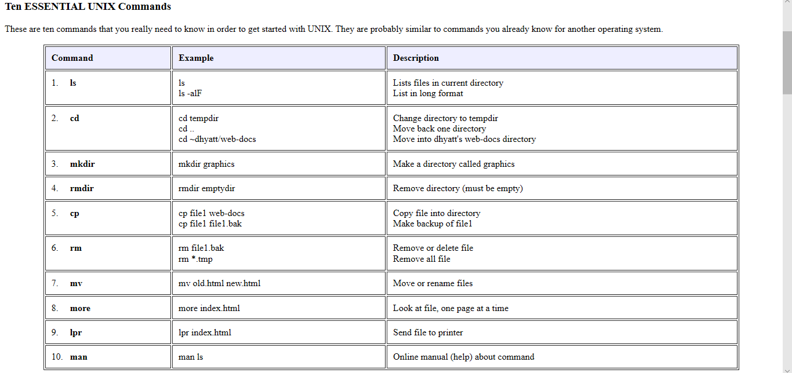

# KIK-LG219: Command Line Tools for Linguists

This course was aimed at students of linguistics that wanted to learn how to use basic command line tools for their research. It offered a short overview over various topics.
Our _cheatsheet_:

## Week 1

Before we started, we had to get our command line environments up and running. I chose to download ubuntu because I worked on a windows 10 system. We also discussed the basics such as actions regarding files and directories, moving, deleting, creating and looking at them. For example, we learned that **cd [insert directory]** would change our directory to the chosen subdirectory.

## Week 2

In this week, we learned how to handle (background) processes and also worked with files on a server. An essential command we learned was _chmod_, which can be used to change the permissions on a file or directory. With **chmod 755 [file or directory name]** execution permissions can be given for the current user, often resolving permission issues quickly.
Exemplary chmod codes:

| user | group | other | result |
| ---- | ----- | ----- | ----- |
| 7    | 0     | 0     | read, write and execute permission for owner, none for group and other |
| 7    | 5     | 5     | same as above, but group and other can read and execute |
| 4    | 4     | 4     | all can read only |

## Week 3

The third week was dedicated to language encoding system. The tutorials revolved around the different options, converting them and how (or when not) to open them. A new command that could be particularly useful for linguistic matters was _egrep_. Used in the structure **egrep -f [PATTERN_FILE] [SEARCH_FILE]** it uses the patterns in the first file and looks them up in the second file. The option _-f_ makes sure all possible patterns are looked for and the option _-w_ only selects perfect matches, while disregarding incomplete ones.

## Week 4

The work on corpora files continued, this time with _sed_, a stream editor that filters and changes text. The _diff_ command was also introduced, for example to view the different lines in two files and extracting them into a new file by using **diff [file 1] [file 2] > [new file]**.

## Week 5

We personalized our .bashrc and .bash_profile files to change our command line environment to our liking and to avoid typing in passwords time after time. After changing those files, we ran **source .bashrc** or **source .bash_profile** to refresh the changes and activate them.

## Week 6

Sudo was discussed in order to become the root user when giving commands. Most importantly this week, we installed software via _apt-get_ or _pip_. The command **pip3 install guess_language-spirit** installes a software that recognizes the language of the text sample it received, even though it is not always correct.

## Week 7

Week 7 was dedicated to Github, a website where you can access remote repositories for your projects. You can, for example, create a new repository or fork an existing one. To synchronize the remote and the local directories, we used 

* **git add -A** (= add everything new) 
* followed by **git commit -m ["some comment"]** (= commit with a message) 
* and **git push origin [branch]** to finalize. 

It was also underlined, that the _pull_ command should not be forgotten, especially on joined projects.

## Week 8 - final assignment

Jekyll was introduced as a tool to transform our text into an actual website to host through github. With **bundle exec jekyll serve** our github.io website goes online.
